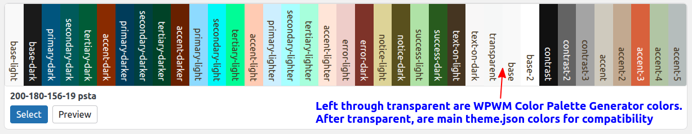
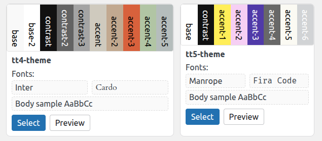
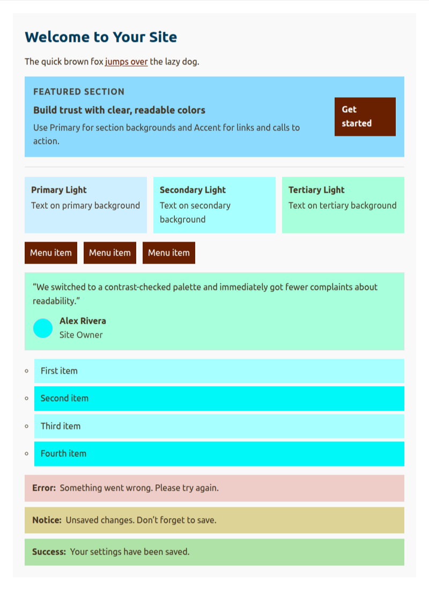
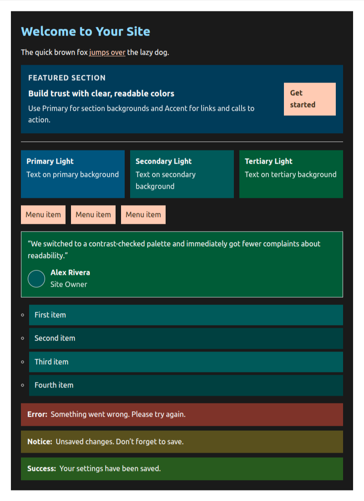
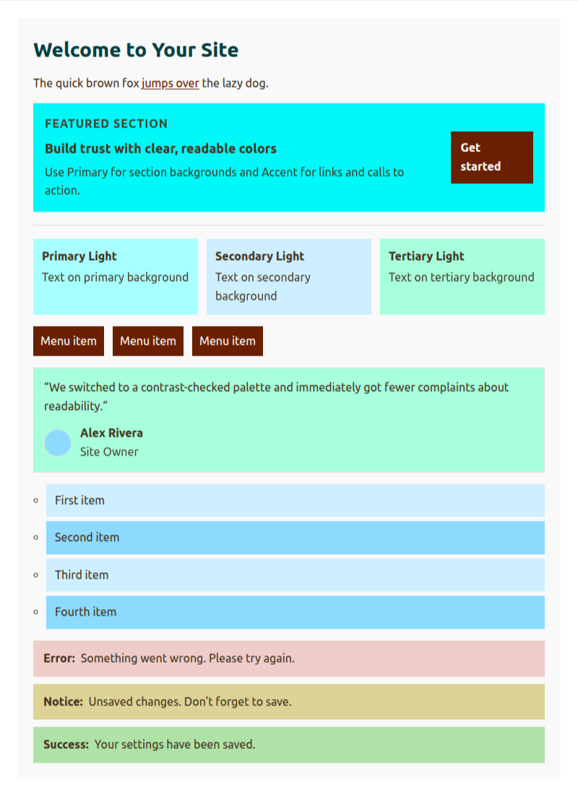
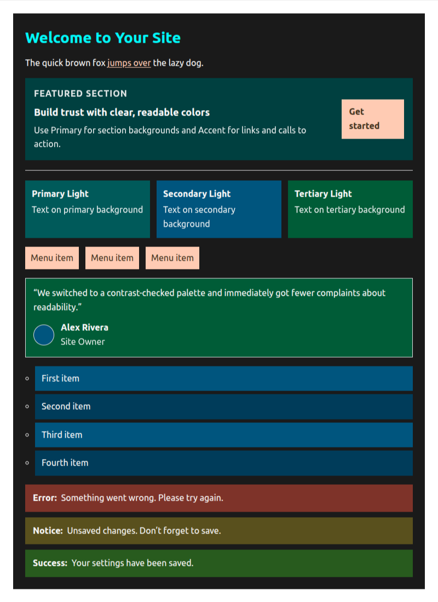

# WPWM Theme Variation Display

**Contributors:** lernerconsult
**Tags:** site editor, global styles, style variations, palette, colors, fonts, theme.json
**Requires at least:** 6.7
**Tested up to:** 6.9.1
**Requires PHP:** 8.0
**Stable tag:** 0.1.0
**License:** GPLv3 or later
**License URI:** https://www.gnu.org/licenses/gpl-3.0.html
**Donate link:** https://wp-website-mastery.com/donate

A detailed preview of WordPress Style Variations (colors & fonts) installed on the theme.

Use instead of the Site Editor's Browse Styles (which shows only a tiny square for each variation, with no preview of the colors).

Installs in **Appearance → Theme Variation Display**.

## Description

WPWM Theme Variation Display lists available Style Variations for the active theme and renders a compact, variable‑accurate preview for each card:

- Will show every color in the Style Variation, and the color name (from the theme.json file).
- Font samples pulled from the variation’s settings, when available. (Must be a font that is available on the site, or displays as a generic font.)
- Scroll through all Variations, and see a "sample page" of the colors, if the colors follow recognized names.
- A "Select" button to apply the variation to the site, as you are viewing them.
- Works even if the Theme Variation uses CSS variables.
- Can be used with any theme, not just those that use the Site Editor.

Click the "Select" button to apply the variation to the site.

This helps theme authors and site builders evaluate multiple variations quickly without opening each one.

When the plugin is Activated, it will create a new menu item in Appearance → Theme Variation Display.

## Features

- View each theme variation available, with a preview of the colors and fonts.
- Sample page of colors (attempts to display the colors even if the colors do not follow recognized names).
- View each sample page in light and dark mode.
- Apply your chosen variation to the site.
- Uses each variation’s own CSS variables for accurate color display.
- Contrast‑aware swatch labels (including semi‑transparent colors using RGBA) for legibility.
- Responsive card layout that wraps to your viewport.

> Note: This plugin does not modify your theme or content. You can select your preferred variation to apply it to the site. It is a visual aid inside Appearance → Theme Variation Display.

The WPWM Color Palette Generator (https://wp-website-mastery.com/color-palette) generates Color Palettes as Theme Variations, with CSS light-dark().

The WPWM Color Palette Generator and Theme Variation Display plugins work together to create a complete solution for theme authors and site builders.

They are part of my upcoming course, "WordPress Websites: from Overwhelm to Mastery", at WP Website Mastery (https://wp-website-mastery.com).

## Installation

1. Upload the plugin folder to `/wp-content/plugins/wpwm-theme-variation-display/` or install via the Plugins screen.
- Install the GitHub Updater https://github.com/afragen/github-updater
- Specify my GitHub repository https://github.com/glerner/wpwm-theme-variation-display.git
2. Activate the plugin via the Plugins screen.
3. Open Appearance → Theme Variation Display.

## Frequently Asked Questions

### Does this change my theme settings?

No. “Preview” does not save any changes. “Select” applies the chosen variation via existing Site Editor APIs. Theme Settings are different, and are not modified.

### Why do some palettes show fewer labels?

Only colors defined by the variation are displayed. Base theme colors that are not redefined are intentionally omitted to avoid confusion.

### Does it support transparent colors?

Yes. RGBA backgrounds are composited against the card background before text contrast is calculated. This is done to ensure that the text is legible. Note: The theme designer might not have intended this color to be shown on this background color.

## Screenshots

### 1. Variation cards with stripe swatches and font samples.

Colors are shown, with text color chosen to be legible on the background color.

**Note:** This Theme Variation Viewer is designed for the [WPWM Color Palette Generator](https://github.com/glerner/wpwm-color-palette-generator). For other palettes, colors likely won't be displayed how the theme designer intended.

### 2. Detail of contrast‑aware labels over swatches.

### Demo of Light mode and Dark mode

Original color order, light mode

Original color order, dark mode

Swap original primary and secondary color order, light mode

Swap original primary and secondary color order, dark mode

## Changelog

### 0.1.0

- Initial public release.

## Upgrade Notice

### 0.1.0

Initial release.
