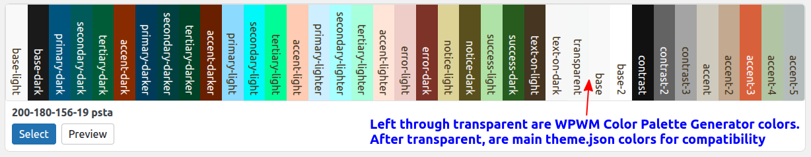
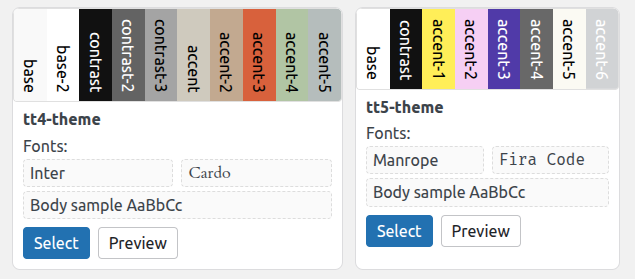
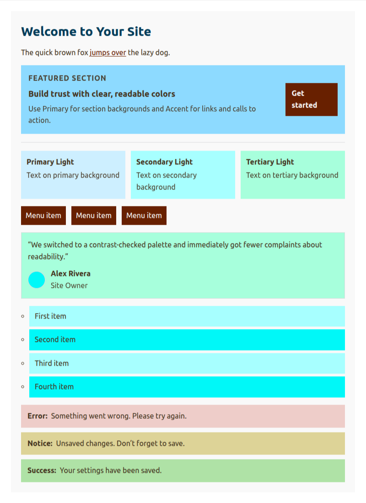
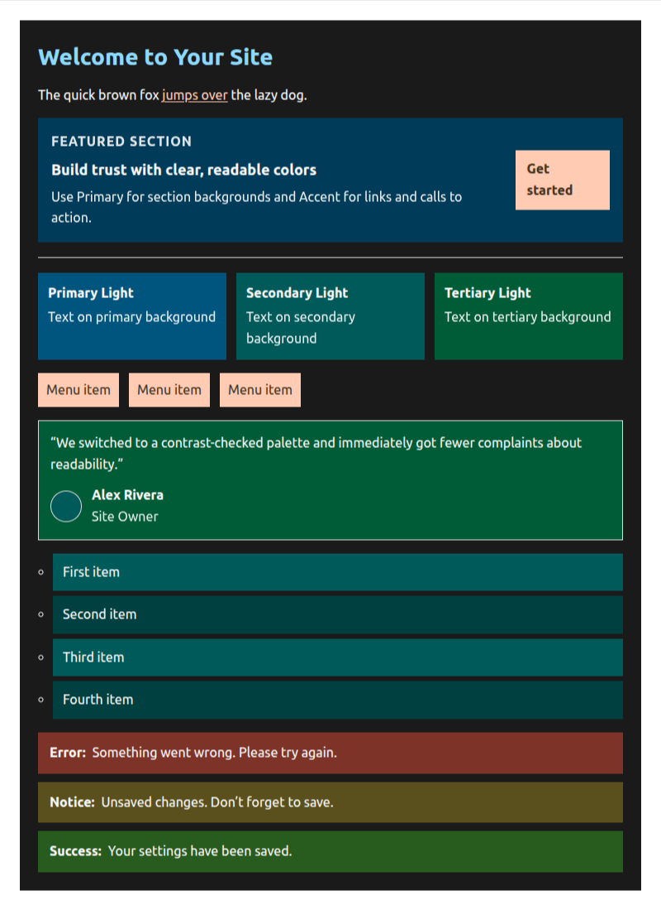
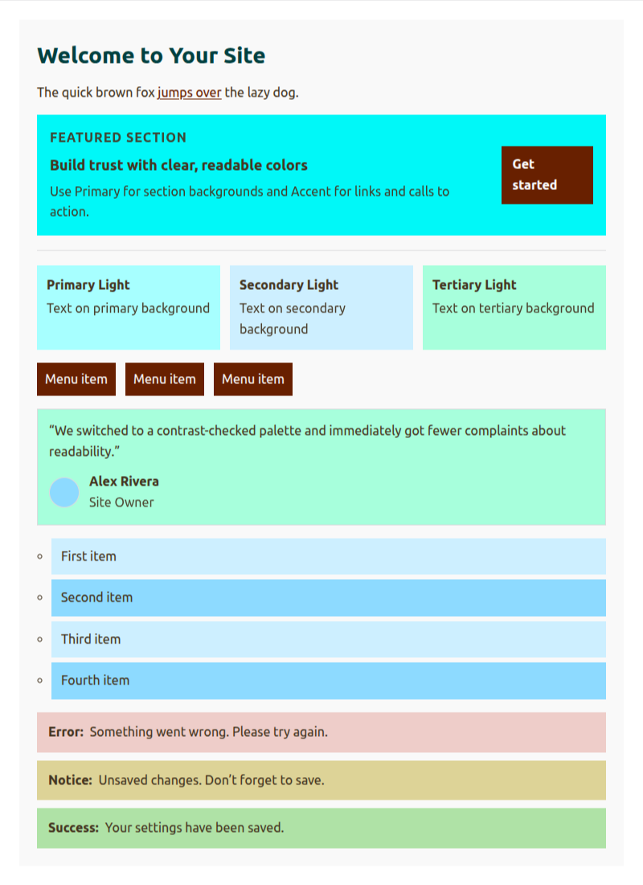
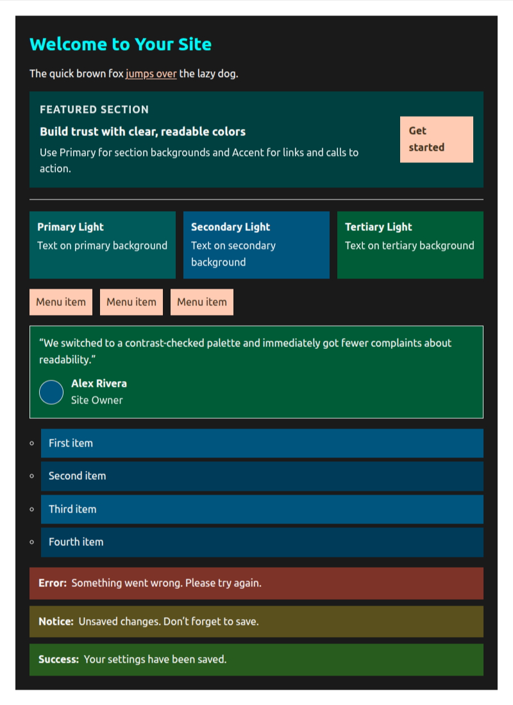

# WPWM Theme Variation Display

**Contributors:** lernerconsult
**Tags:** site editor, global styles, style variations, palette, colors, fonts, theme.json
**Requires at least:** 6.7
**Tested up to:** 6.9.1
**Requires PHP:** 8.0
**Stable tag:** 0.1.0
**License:** GPLv3 or later
**License URI:** https://www.gnu.org/licenses/gpl-3.0.html
**Donate link:** https://wp-website-mastery.com/donate

A detailed preview of WordPress Style Variations (colors & fonts) installed on the theme.

Use instead of the Site Editor's Browse Styles (which shows only a tiny square for each variation, with no preview of the colors).

Installs in **Appearance → Theme Variation Display**.

## Description

WPWM Theme Variation Display lists available Style Variations for the active theme and renders a compact, accurate preview for each card:

- Will show every color in the Style Variation, and the color name (from the theme variation's theme.json file).
- Font names in the variation, when available. (If the font is available on the site, it will display using it; otherwise, it will display as a generic font.)
- Scroll through all Variations, and see a "sample page" of website elements using the colors.
  - If the colors follow recognized names, the sample page will show the colors of the variation, using good WordPress or HTML elements for the color.
  - If the colors do not follow recognized names, the sample page will use the colors of the variation, probably not in the elements the designer intended.
- A "Select" button to apply your chosen variation to the site, as you are viewing them.
- Works even if the Theme Variation uses CSS variables instead of color numbers.
- Can be used with any theme, not just those that use the WPWM Color Palette Generator.
- Good for showing old and new theme variations to clients.

The WPWM Color Palette Generator (https://wp-website-mastery.com/color-palette) generates Color Palettes as Theme Variations, with CSS light-dark() support.
- It generates all the permutations of colors (either 6 or 24 permutations, depending on whether you know which color you want for the Accent color).
- It generates the colors as CSS variables, so they can be changed in your site by simply installing a new variation; after you have changed all hard-coded colors, you can use the WPWM Color Palette Generator to generate a new variation, instead of redoing your site.
- It adds light-mode and dark-mode support to your theme, whether it originally had it or not. These are using your brand colors, not generated by some algorithm. To let visitors switch modes, install the WPWM Color Scheme Toggle plugin:
  - https://github.com/glerner/wpwm-color-scheme-toggle
  - Follow its README for the latest install/usage instructions.
- Only colors that have WCAG AAA contrast with your specified text colors (near-black or near-white) are generated.
	- If you use only these colors (and your plugins use only these colors), then your site will be WCAG AAA compliant.
	- Many plugins do not use the WordPress color palette, so they will not be WCAG AAA compliant until you make CSS rules for them that use the WordPress color palette; or change those elements to use colors from your palette instead of their default colors.

WPWM Theme Variation Display was designed to show all those 6 or 24 Theme Variations, so you can see how the colors will look on your site, assigned to some of the most common WordPress elements, and select the one you want to use.

Click the "Select" button to apply your chosen variation to the site.

This helps theme authors and site builders evaluate multiple variations quickly without opening each one.

When the plugin is Activated, it will create a new menu item in Appearance → Theme Variation Display.

## Features

- View each theme variation available, with a preview of the colors and fonts.
- Sample page of colors (attempts to display the colors even if the colors do not follow recognized names).
- View each sample page in light and dark mode. (For a front-end toggle button, use WPWM Color Scheme Toggle: https://github.com/glerner/wpwm-color-scheme-toggle)
- Apply your chosen variation to the site.
- Uses each variation’s own CSS variables for accurate color display.
- Contrast‑aware swatch labels (including semi‑transparent colors using RGBA) for legibility.
- Responsive card layout that wraps to your viewport.

> Note: This plugin does not modify your theme or content. You can select your preferred variation to apply it to the site. It is a visual aid inside Appearance → Theme Variation Display.

The WPWM Color Palette Generator (https://wp-website-mastery.com/color-palette) generates Color Palettes as Theme Variations, with CSS light-dark().

The WPWM Color Palette Generator and Theme Variation Display plugins work together to create a complete solution for theme authors and site builders.

They are part of my upcoming course, "WordPress Websites: from Overwhelm to Mastery", at WP Website Mastery (https://wp-website-mastery.com).

## Installation

1. Upload the plugin folder to `/wp-content/plugins/wpwm-theme-variation-display/` or install via the Plugins screen.
   - Install the GitHub Updater https://github.com/afragen/github-updater
   - Specify my GitHub repository https://github.com/glerner/wpwm-theme-variation-display.git
2. Activate the plugin via the Plugins screen.
3. Open Appearance → Theme Variation Display.

Optional (recommended for palettes generated by WPWM Color Palette Generator): install WPWM Color Scheme Toggle so visitors can switch Light/Dark/Auto modes on the front end (this plugin’s Light/Dark view is for preview only):
- https://github.com/glerner/wpwm-color-scheme-toggle

## Frequently Asked Questions

### Does this change my theme settings?

No. “Preview” does not save any changes. “Select” applies the chosen variation via existing Site Editor APIs. Theme Settings are different, and are not modified.

### Why do some palettes show fewer labels?

Only colors defined by the variation are displayed. Base theme colors that are not redefined are intentionally omitted to avoid confusion.

### Does it support transparent colors?

Yes. RGBA backgrounds are composited against the card background before text contrast is calculated. This is done to ensure that the text is legible. Note: The theme designer might not have intended this color to be shown on this background color.

## Screenshots

### 1. Variation cards with stripe swatches and font samples.

Colors are shown, with text color chosen to be legible on the background color.

**Note:** This Theme Variation Viewer is designed for the [WPWM Color Palette Generator](https://gl-color-palette-generator.vercel.app/). For other palettes, colors likely won't be displayed how the theme designer intended.

### 2. Detail of contrast‑aware labels over swatches.

### Demo of Light mode and Dark mode

Original color order (psta for Primary, Secondary, Tertiary, Accent), light mode

Original color order (psta for Primary, Secondary, Tertiary, Accent), dark mode

Theme Variation that Swaps the original primary and secondary color order (spta for Secondary, Primary, Tertiary, Accent), light mode

Theme Variation that Swaps the original primary and secondary color order (spta for Secondary, Primary, Tertiary, Accent), dark mode

## Changelog

### 0.1.0

- Initial public release.

## Upgrade Notice

### 0.1.0

Initial release.
